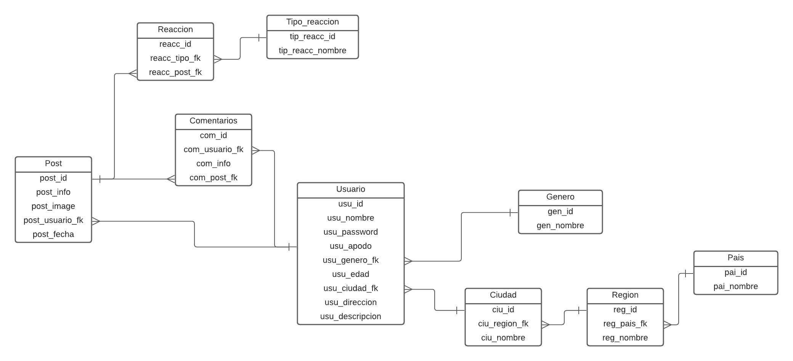

# CamperImpact

## Descripción

La página web es una plataforma interactiva que permite a los usuarios crear su propio perfil y compartir contenido a través de comentarios y posteos. El objetivo principal de La plataforma es brindar un espacio seguro y libre para que los usuarios puedan expresarse y conectarse con otros.

## Objetivos Especificos

- Crear una plataforma en línea en la cual los usuarios tengan que logearse y que permita a los usuarios crear y personalizar sus perfiles con información relevante

- Implementar un sistema de comentarios y posteos que permita a los usuarios interactuar entre sí, compartiendo opiniones, ideas y preguntas sobre diferentes temas.

- Tener la posibilidad de revisar los perfiles de otros usuarios, ver sus publicaciones y responder a sus preguntas.

- Desarrollar una base de datos que almacene la información principal de los usuarios

- Diseñar una clasificación de tipos de publicaciones (Post y Preguntas) para que los usuarios puedan seleccionar el formato adecuado para compartir su contenido.

- Implementar un sistema de reacciones en las publicaciones, donde los usuarios puedan expresar sus opiniones sobre el contenido compartido mediante likes, dislikes, me encanta, etc.

## Características principales

- **Creación de perfiles personalizados:** Los usuarios podrán crear su propio perfil personalizado. Podrán agregar información personal, como una foto de perfil, una biografía, datos personales y enlaces a sus redes sociales o sitios web.
- **Comentarios y posteos:** Los usuarios podrán realizar comentarios en las publicaciones de otros usuarios, así como también realizar sus propios posteos. Podrán compartir opiniones, ideas, preguntas o cualquier otro tipo de contenido relevante para la comunidad.
- **Interacción social:** La plataforma proporcionará funciones de interacción social, como revisar el perfil de cada usuario y ver sus publicaciones o responder a preguntas y dudas.

## Creacion

Se tiene pensado crear una base de datos con la siguiente informacion:

### Tablas

**- Usuarios:**  en la tabala usuarios guardaremos la informacion principal de cada uno de los usuarios, como lo son: id_numero_telefono, password, foto, nombre completo, apodo, edad, ciudad_recidencia, direccion, descripcion_personal.

**- Pais:** en la tabla pais tendremos los paices que los usuarios pueden elegir como nacionalidad.

**- Region:** En la tabla region tendremos los departamentos que los usuarios pueden elegir como residencia.

**- Ciudad:** En la tabla ciudad tendremos las ciudades de dicho departamento escogido para que los usuarios puedan elegir su ciudad de recidencia.

**- Genero:** En la tabla genero tendremos los generos que los usuarios pueden elegir a la hora de crear su perfil

**- Post:** En la tabla Post tendremos el tipo de post con el post que se va a hacer y la fecha en que se realiza.

**- Comentarios:** En la tabla Comentarios tendremos los comentarios que el usuario hace a un post especifico.

**- Tipo_reaccion:** En la tabla tipo de reaccion tendremos los tiepos de reaccion que se pueden tener sobre un post, por ejemplo: like, dislike, me encanta, etc. 

**- Reaccion:** En la tabla de Reaccion tendremo el tipo de reaccion y que post es el que tiene es reaccion.


## Diagrama Entidad Relacion



## EndPoints

algunos de los endpoints que tenemos pensados utilizar:

- Crear un endpoint que nos traiga el listado de todos los usuarios
- Crear un endpoint que nos filtre los usuarios por genero o por nacionalidad
- Crear un endpoint que nos traiga las publicaciones realizados por un usuario especifico en orden del mas reciente al mas antiguo.
- Crear un endpoint que nos filtre las publicaciones de un usuario de la mas popular a la menos popular
- Crear los cruds que agregan usuarios, post, comentarios.

## A Tener en Cuenta

- Es importante tener en cuenta que esta es nuestra primera idea sobre nuestro aplicativo, por lo tanto en el transcurso de los dias nuestras tablas o endpoints pueden estar sometidas a cambios, mejoras o inserciones.

- se manejara un token de acceso **JWT** para limitar la manipulacion de nuestra Api (mas adelante se explicara mejor esta parte)

- Los datos que se ingresaran seran validados y transfromados utilizando **DTO**.

## Funcionamiento
## Requisitos previos

- Node.js instalado en tu máquina.

## Instalación

1. Clona este repositorio o descarga los archivos en tu máquina local.
2. Abre una terminal en el directorio raíz de la aplicación.
3. Ejecuta el siguiente comando para instalar las dependencias:

```
npm install
```

## Configuración

1. Asegurarse de tener creada la base de datos con sus respectivos registros. en la ruta **db/db_camper_impact** se encuentran los comandos para la creacion de la base de datos y la inserción de algunos registros de prueba.
2. Crea un archivo `.env` en el directorio raíz de la aplicación, teniendo como base el archivo `.env.example`
3. Dentro del archivo `.env` , define las siguientes variables de entorno:

```
MY_CONFIG={"hostname":"", "port":}
MY_CONNECT={"host":"", "user":"", "password":"", "database":"", "port":3306}
JWT_PRIVATE_KEY = ""
```

4. abrir 2 terminales, en una correr el comando `npm run dev` y en la otra el comando `npm run tsc`, para que todo funcione a la perfeccion.

## Uso
### Importante
Antes de empezar a utilizar las diferentes rutas y endPoints debemosos generar un token de acceso, que debemos colocar en nuestro **header/Autorization**, este token tiene un limite de **30m**, en ese rango de tiempo podremos acceder a las rutas y endPoints de nuestra Api.

- para generar nuestro token, debemos acceder a nuestra extencion de visual estudio llamada **Thunder-Client**, colocar la siguiente ruta:

- `GET: http://"hostname":"port"/token/`

y en body, lo siguiente:
```js
{
    "tel": 325412451,
    "password": "Villafrades"
}
```
Por el momento esos datos ingresados en el body no tienen ninguna normativa o funcionamiento, es simplemente para simular el funcionamiento de un inicio de sesion para futuras actualizaciones de nuestro proyecto, asi que cualquier data colocads en su lugar les generara el token sin ningun problema.

perefecto, una vez obtenido nuestro token e ingresado en el header de Autorizacion podremos pasar a probar las siguiente rutas:

## CRUDS
### GETS ALL

- `http://"hostname":"port"/tipoReaccion/` para obtener todos los registros de tipo_reaccion.
- `http://"hostname":"port"/reaccion/` para obtener todos los registros de reaccion.
- `http://"hostname":"port"/genero/` para obtener todos los registros de genero.
- `http://"hostname":"port"/usuario/`para obtener todos los registros de usuario.
- `http://"hostname":"port"/post/`para obtener todos los registros de post.
- `http://"hostname":"port"/comentarios/` para obtener todos los registros de comentarios.

### GETS INDIVIDUAL

- `http://"hostname":"port"/tipoReaccion?id=""` para obtener unico registro correspondiente al id de tipo_reaccion.
- `http://"hostname":"port"/reaccion?id=""` para obtener unico registro correspondiente al id de reaccion.
- `http://"hostname":"port"/genero?id=""` para obtener unico registro correspondiente al id de genero.
- `http://"hostname":"port"/post?id=""` para obtener unico registro correspondiente al id de post.
- `http://"hostname":"port"/comentarios?id=""` para obtener unico registro correspondiente al id de comentarios.
- Tener en cuenta que en el caso de usuario para acceder a la informacion de un solo registro, no se hace por medio del id si no del **apodo**(UNICO) que este tenga:
`http://"hostname":"port"/usuario?apodo=""` para obtener unico registro correspondiente al apodo de usuario.

## POST Y PUT
#### Importante

- tener en cuenta que si se quiere realizar un post o put en las siguientes rutas, se debe realizar de la manera en que se explica y respetando el orden y la estructura de los datos de entrada, ya que el codigo esta programado para validar la estructura de los datos de entrada y en caso de no concordar el orden de la estructura este retornara un error.

-Respetar tambien el tipo de dato que se debe ingresar.

### POST: `http://"hostname":"port"/usuario/`
### PUT: `http://"hostname":"port"/usuario?apodo=""`

Este endpoint nos permitira agregar o modificar un registro de un usuario, especificando: sus datos principales, un genero, nacionalidad, direccion, etc.

**Parámetros de entrada:**

- `tel` : Numero de telefono del usuario, debe ser unico, no se puede repetir en 2 usuarios ya que este mas adelante sera el user en el login. (number).
- `nombre_completo` : Nombre completo de nuestro usuario. (string)
- `password` : password que en futuras actualizaciones se utilizara para iniciar session, la password cuenta con unos requisitos, por lo menos(una mayuscula, una minuscula,uno de los siguientes caracteres @-#-/-., tener minimo 8 caracteres y maximo 12). (string).
- `apodo` : El apodo sera el nombre con el que el usuario de identificara dentro de nuestra pagina, debe ser un apodo unico (string)
- `genero_id` : Id del genero de nuestro ususario 1-Hombre, 2-Mujer, 3-No definido (number).
- `edad` : Edad de nuestro usuario (string).
- `ciudad_id` : Id de la ciudad de recidencia (number).
- `direccion` : Direccion de recidencia o null si no quiere agregar (string).
- `descripcion` : Breve descripcion sobre nuestra usuario, algun dato importante o caracteristico (string).
- `image` : por el momento las propiedades de imagenes las tenemos como null, mientras en futuras modificaciones se dara acceso a guardar una imagen o foto caracteristica de nuestro usuario (string).

###### Ejemplo

```js
{
   "tel": 317504947,
    "nombre_completo": "Carlos Alberto Villafrades",
    "password":"Carlos1@",
    "apodo": "ElVilla",
    "genero_id": 1,
    "edad": 22,
    "ciudad_id": 1,
    "direccion": "calle 11",
    "descripcion": "Hola, soy Carlos Villafrades y me encanta viajar.",
    "image": null
}
```

### POST: `http://"hostname":"port"/post/`
### PUT: `http://"hostname":"port"/post?id=""`

Este endpoint nos permitira agregar o modificar una publiacion de un usuario.

**Parámetros de entrada:**

- `info` : Agregar infromacion sobre la publicacion que se quiera hacer. (string).
- `image` : por el momento las propiedades de imagenes las tenemos como null, mientras en futuras modificaciones se dara acceso a guardar la imagen que quiera adjuntar el usuario en su publicacion (string).
- `apodo_usuario` : apodo identifictivo del usuario que genero la publiacion. (string)

###### Ejemplo

```js
{
   "info": "¡Hermoso día en la playa!",
    "image": null,
    "apodo_usuario": "ElVilla"
}
```

### POST: `http://"hostname":"port"/comentarios/`
### PUT: `http://"hostname":"port"/comentarios?id=""`

Este endpoint nos permitira agregar o modificar un comentario a una publiacion ya realizada por un usuario.

**Parámetros de entrada:**

- `apodo_usuario` : apodo identifictivo del usuario que genero el comentario. (string)
- `info` : Agregar infromacion del comentario que se quiera hacer. (string).
- `post` : Id del post al que se le esta egnerando el comentario (number).


###### Ejemplo

```js
{
   "apodo_usuario": "ElVilla"
    "info": "¡Exelente post amigo!",
    "post": 1,
}
```

### POST: `http://"hostname":"port"/reaccion/`
### PUT: `http://"hostname":"port"/reaccion?id=""`

Este endpoint nos permitira agregar o modificar una reaccion a una publiacion ya realizada por un usuario.

**Parámetros de entrada:**

- `tipo_reaccion` : Id de la reaccion que se quiere generar hacia el post. (number).
- `post` : Id del post al que se le esta agregando esa reaccion (number).


###### Ejemplo

```js
{
    "tipo_reaccion": 1,
    "post": 2,
}
```

## DELETE

para eliminar registro se utilizan las siguientes rutas:

- ### DELETE: `http://"hostname":"port"/usuario?apodo=""`
 para eliminar unico registro correspondiente al apodo de usuario.

- ### DELETE: `http://"hostname":"port"/reaccion?id=""` 
para eliminar unico registro correspondiente al id de reaccion.

- ### DELETE: `http://"hostname":"port"/post?id=""`
 para eliminar unico registro correspondiente al id de post.

- ### DELETE: `http://"hostname":"port"/comentarios?id=""`
 para eliminar unico registro correspondiente al id de comentarios.

## ENDPOINTS

### GET: `http://"hostname":"port"/usuario/`
este endPoint nos permitira traer un listado de todos los usuarios registrados en nuestra pagina, eso si, respetando y manteniendo oculto y portegido su user y password.

### GET: `http://"hostname":"port"/usuario/nacionalidad/"idNacionalidad"`
este endPoint no filtrara todos los usuarios pertenecientes a una misma nacionalidad

### GET: `http://"hostname":"port"/usuario/usuario/"apodoUsuario"`
este endPoint nos traera todas las publiaciones realizadas por un usuarios especifico, ordenandolas de las reciente a la mas antigua.

### GET: `http://"hostname":"port"/usuario/popularidad`
este endPoint nos traera todas las publiaciones ordenadas de la mas popular, osea de la que mas a tenido reacciones a la menos popular.

### En futuras actualizaciones
En futuras actualizaciones se espera poder realizar el tema del login o inicio de session, ademas de identificar al usuario de una vez al iniciar session sin necesidad de colocarlo manualmente en cada publicacion o comentario. tambien se espera crecer un poco mas la pagina angregandole mas tablas y mejores interacciones a la base de datos, ademas de mejores validaciones para el manejo de la infromacion que se ingresa.

## Contacto

Nombre: Carlos Villafrades Pinilla

Email: cavillafrades@gmail.com